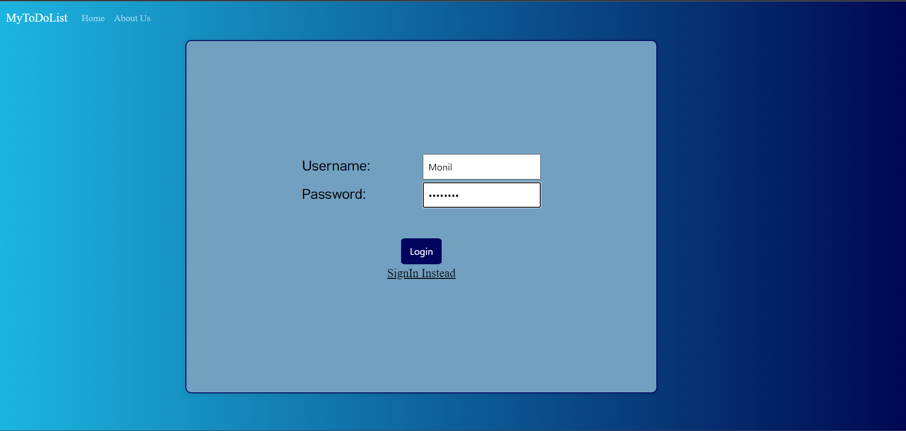
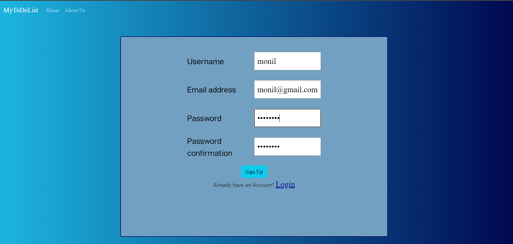
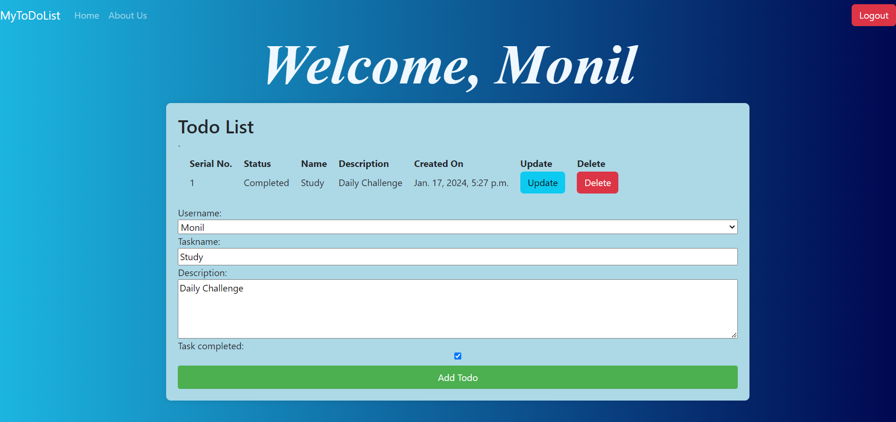

# ToDoList Project

Welcome to the ToDoList project! This project is a simple web-based to-do list application created using Django.

## Screenshots

Include screenshots of the login, signup, and main landing page here.

*Caption: Login Page*

*Caption: Signup Page*

*Caption: Main Landing Page*

## Getting Started

Follow these instructions to get a copy of the project up and running on your local machine.

## Prerequisites

    -Python
    -Django

## How to Use

1. **Clone the Repository:**
   [git clone](https://github.com/your-username/ToDoList.git)

2.  **Navigate to the Project Directory:**
'cd ToDoList'

3. **Install Dependencies:**
'pip install -r requirements.txt'

4. **Run the Development Server:**
    'python manage.py runserver'

Open your browser and visit http://localhost:8000

## Contributing

If you'd like to contribute to this project, please follow these steps:

    -Fork the repository.
    -Create a new branch: git checkout -b feature/my-feature
    -Make your changes and commit them: git commit -am 'Add some feature'
    -Push to the branch: git push origin feature/my-feature
    -Create a pull request.

## License
This project is licensed under the MIT License - see the LICENSE file for details.
